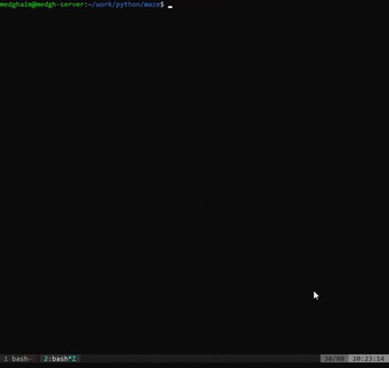

# Maze generator
A python-based maze generator which uses a DFS to randomly generate paths in the maze

# TODO
- Proper project structure
- Arg parsing
- Maze class
- Visualizing solving
- Ability to randomly generate "blocks" of cells in the maze which act as impassable areas
